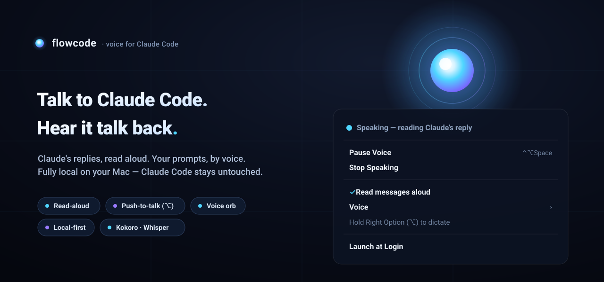
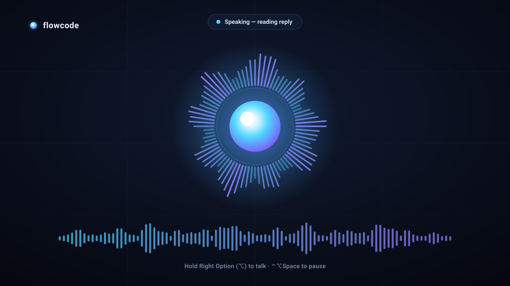

<p align="center">
  
</p>

<h1 align="center">flowcode 🔊 — the voice of Claude Code</h1>

<p align="center"><em>Talk to Claude Code. Hear it talk back. Fully local, on your Mac.</em></p>

<p align="center">
  <a href="https://github.com/michalstrnadel/flowcode-app/actions/workflows/ci.yml"></a>
  
  
  
  
  
</p>

---

flowcode is a tiny native macOS **menu-bar app** that gives [Claude Code](https://claude.com/claude-code)
a voice. It reads each new assistant reply **aloud** (local Kokoro TTS) and lets you **dictate**
prompts by holding a key (local Whisper STT) — while a luminous, audio-reactive orb reacts to the
conversation. Claude Code itself runs completely unmodified; flowcode just sits beside it.

No cloud. No account. No plugin. Your voice and Claude's words never leave your Mac.

## What it does

- 🔊 **Read-aloud** — every new assistant message is spoken via local **Kokoro** TTS, with the orb
  pulsing to the speech. Tool-call narration and code blocks are skipped — you hear the prose, not the plumbing.
- 🎙️ **Push-to-talk dictation** — hold **Right Option (⌥)**, speak, release. Your words are
  transcribed by local **Whisper** and pasted into whatever app is focused (your terminal, an editor,
  anywhere). It never presses Enter — *you* commit.
- ⏯️ **Pause / Resume** the whole voice layer with **⌃⌥Space** or the menu — the mic is released the
  moment you're not dictating.
- ✦ **Orb HUD** — a luminous, audio-reactive orb that shows when flowcode is listening,
  speaking, or idle.
- ⚡ **Local-first & private** — TTS and STT are localhost services; nothing is sent to the cloud.

<p align="center">
  
</p>

## Works with

| | |
|---|---|
| 🤖 **Claude Code** | Any session, completely unmodified — flowcode reads the transcript it already writes. |
| 🗣️ **Kokoro TTS** | Local text-to-speech (`127.0.0.1:8880`) — read-aloud, with a pickable voice. |
| ✍️ **Whisper STT** | Local speech-to-text (`127.0.0.1:2022`) — push-to-talk dictation. |
| 💻 **macOS 14+** | Apple Silicon & Intel. Menu-bar agent, no Dock icon. |
| ⌨️ **Your terminal / editor** | Warp, Terminal, iTerm2, VS Code… dictation pastes into the focused app. |

## Quick start

Requires **macOS 14+** and the two local voice services. A single idempotent script installs the
services, builds the app, and walks you through permissions:

```sh
git clone https://github.com/michalstrnadel/flowcode-app.git
cd flowcode-app
scripts/setup.sh
```

Then launch **flowcode.app** — the orb appears in your menu bar. `setup.sh` checks prerequisites
(Homebrew, [uv](https://docs.astral.sh/uv/), Swift), installs + starts Kokoro and Whisper as
launchd agents, builds + signs the app, and opens the right System Settings panes.

> You can also invoke it from inside Claude Code with the bundled **`/setup`** skill.

### Permissions (one time)

| Feature | Microphone | Accessibility |
| --- | :---: | :---: |
| **Read-aloud** | — | — |
| **Dictation** (⌥) | ✅ | ✅ (to paste the transcript) |

Read-aloud works immediately with **no** permissions. Dictation needs both; flowcode prompts the
first time you hold ⌥. (macOS can't grant these from a script — you flip the toggles in System
Settings → Privacy & Security.)

## The menu

```
◉  Speaking — reading Claude's reply
─────────
Pause Voice            ⌃⌥Space        ↔ Resume Voice
Stop Speaking                          (enabled while speaking)
─────────
✓ Read messages aloud                  (relaunch to apply)
  Voice ▸  Sky · Bella · Adam · …      (pick a Kokoro voice)
  Hold Right Option (⌥) to dictate
─────────
✓ Launch at Login                      (real SMAppService login item)
  Open Log…
─────────
Quit flowcode          ⌘Q
```

## How it works

```
Claude Code session JSONL ──tail──▶ flowcode ──HTTP──▶ Kokoro TTS (:8880) ──▶ 🔊 + orb
        ⌥ hold ──▶ mic capture ──HTTP──▶ Whisper STT (:2022) ──paste──▶ focused app
```

flowcode tails the transcript Claude Code already writes (`~/.claude*/projects/…/<session>.jsonl`)
and speaks each new assistant message from the **active** session. The mic opens **only** while you
hold ⌥, and closes the instant you let go. No socket, no Python core, no MCP server — read-aloud and
dictation are entirely self-contained in the Swift app plus the two local services.

## Troubleshooting

- **No audio** → confirm the services: `curl -fsS http://127.0.0.1:8880/v1/audio/voices` and
  `curl -fsS http://127.0.0.1:2022/health`. Re-run `scripts/setup.sh` if needed; logs are in `~/.voicemode/logs/`.
- **Dictation silent** → grant Accessibility + Microphone to flowcode, then relaunch. (Dev builds are
  ad-hoc signed, so a rebuild may require re-granting.)
- **The orb is stuck** → Pause/Resume (⌃⌥Space), or quit and relaunch.

## Experimental / dormant

flowcode began as a real-time, **interruptible** voice core (barge-in, streaming TTS, semantic
endpointing, a confirmation gate, and a swarm/orchestration HUD), built on a fork of
[voicemode](https://github.com/mbailey/voicemode). That code is still in the repo but **off by
default** — it needs a running voicemode voice core and a control socket, which the shipping
read-aloud experience never uses. It's preserved as the roadmap to true barge-in. See
[`PLAN.md`](PLAN.md) and [`BOUNDARIES.md`](BOUNDARIES.md) (these predate the current default).

## Building from source

```sh
swift build                 # flowcodeKit + the menu-bar app
swift run flowcode          # run from the build dir (dev, ad-hoc signed)
swift run flowcode-selftest # headless verification harness — must print ALL PASS
scripts/preflight.sh        # build + selftest + watchdog typecheck gate
```

See [`DISTRIBUTION.md`](DISTRIBUTION.md) for the notarized-release pipeline (Developer ID + Sparkle +
Homebrew) and [`CLAUDE.md`](CLAUDE.md) for contributor conventions.

## Credits

Voice engines: **Kokoro** (TTS) and **Whisper** (STT). Built on a fork of
**[voicemode](https://github.com/mbailey/voicemode)** (Mike Bailey). Full attribution in
[`THIRD-PARTY-NOTICES.md`](THIRD-PARTY-NOTICES.md).

## License

[MIT](LICENSE) • Michal Strnadel ([michalstrnadel](https://github.com/michalstrnadel))
